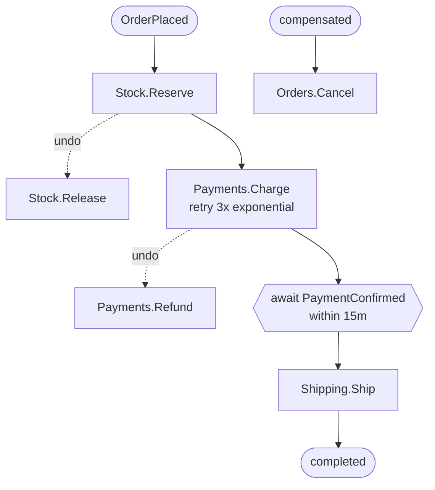

# Shop processes

## OrderFulfillment

```mermaid
flowchart TD
    start(["OrderPlaced"])
    n1["Stock.Reserve"]
    n1 -. undo .-> n1u["Stock.Release"]
    start --> n1
    n2["Payments.Charge<br/>retry 3x exponential"]
    n2 -. undo .-> n2u["Payments.Refund"]
    n1 --> n2
    n3{{"await PaymentConfirmed<br/>within 15m"}}
    n2 --> n3
    n4["Shipping.Ship"]
    n3 --> n4
    n4 --> done(["completed"])
    compensated(["compensated"]) --> outcome["Orders.Cancel"]
```
